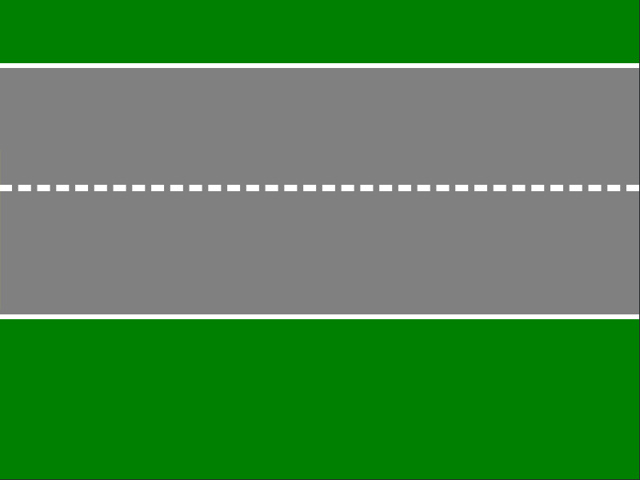

# Car animation created entirely in CSS

---

The project aims to use CSS animation property along with other
CSS quirks (notably pseudo-elements ::after/::before and the position attribute)
in order to create an animation made entirely in CSS.

Below is a low quality gif showing off the effect:

